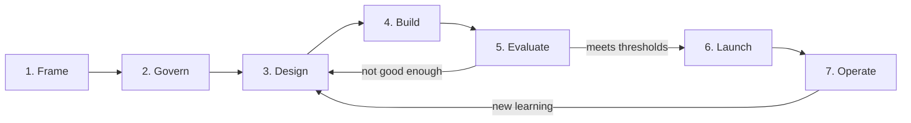

# Overview: problem → live → operated

Seven phases. Phases 1–2 are thinking and governance (days, not months). Phases 3–5 loop — design, build, evaluate, repeat. Phases 6–7 are where AI products are actually won or lost.

## Ground rules (before Phase 1)

1. **Nothing advances without exit criteria met.** Each phase ends with a short checklist; skipping is allowed, silently skipping is not — write down what you skipped and why.
2. **One accountable owner per product.** Named in Phase 2, unchanged by reorgs unless explicitly handed over. *(ISO 42001: leadership and accountability)*
3. **Small batches everywhere.** Applies to code, prompts, model changes, and scope. *(DORA)*
4. **The risk register is a living document,** opened in Phase 2 and reviewed at every phase gate. *(NIST AI RMF: Govern/Manage)*

## Traceability at a glance

| Phase | Primary framework source | Secondary |
|---|---|---|
| 1. Frame | NIST AI RMF: **Map** | Anthropic: simplest-pattern principle; EU AI Act: risk-tier check |
| 2. Govern | NIST AI RMF: **Govern**; ISO 42001: leadership, impact assessment | ⚕ TGA/FDA classification |
| 3. Design | Anthropic: *Building Effective Agents* | NIST Map; DORA: loosely coupled architecture |
| 4. Build | DORA: CI, trunk-based, small batches | Anthropic: prompts/tools as artefacts; ISO: lifecycle documentation |
| 5. Evaluate | NIST AI RMF: **Measure**; Anthropic: eval design | ⚕ clinical validation |
| 6. Launch | DORA: progressive delivery | EU AI Act: transparency; ISO: information to users; ⚕ clearance |
| 7. Operate | NIST AI RMF: **Manage**; DORA: four metrics | ISO: Plan–Do–Check–Act, continual improvement |

## The ⚕ Regulated overlay

Steps marked **⚕** apply when the product operates in a regulated domain (health, finance, legal) or serves EU users. If that's you, the overlay steps are mandatory and the phrase to remember is: **classification first, evidence early, clearance before launch.**
